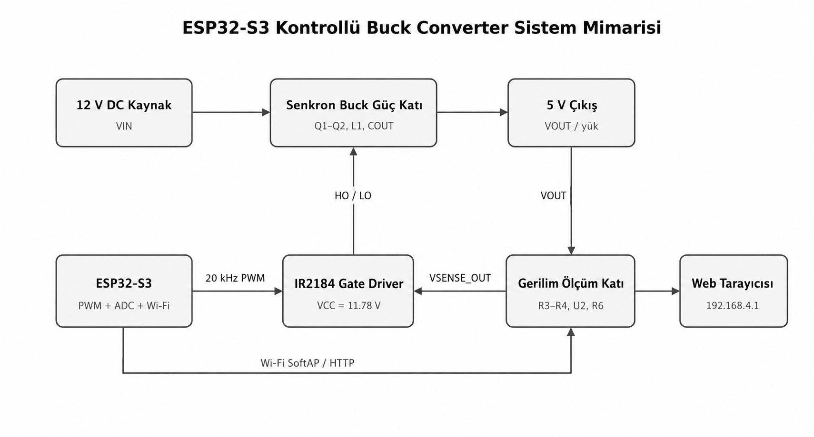
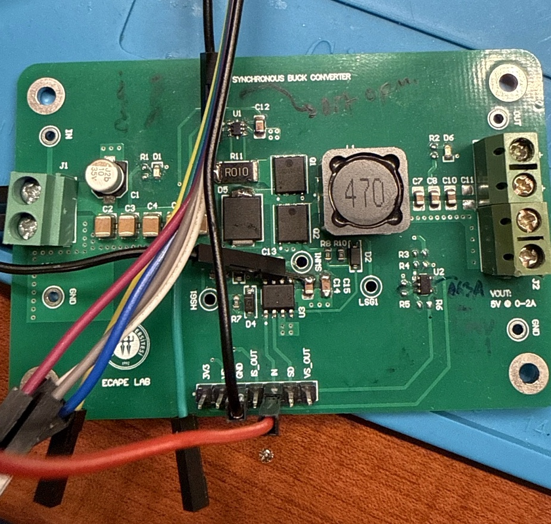
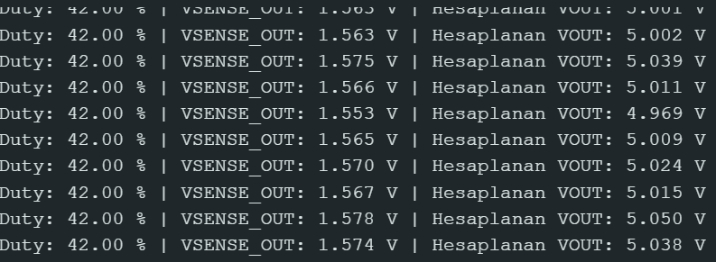
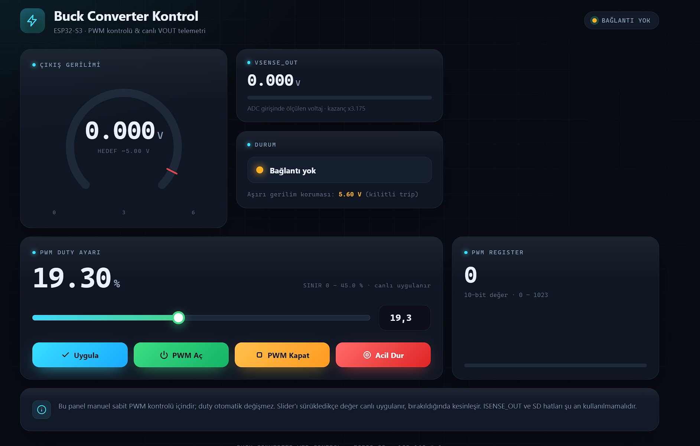

# ESP32-S3 Kontrollü Buck Converter

Bu proje, 12 V DC giriş gerilimini yaklaşık 5 V seviyesine düşüren senkron buck converter devresinin ESP32-S3 ile kontrol edilmesini amaçlamaktadır.

ESP32-S3 tarafından üretilen 20 kHz PWM sinyali IR2184 gate driver üzerinden güç MOSFET’lerine uygulanmaktadır. Çıkış gerilimi kart üzerindeki ölçüm devresiyle izlenmekte ve yerel Wi-Fi ağı üzerinden çalışan web arayüzünde gösterilmektedir.

## Sistem Mimarisi



Sistemde ESP32-S3;

* PWM sinyali üretir,
* VSENSE_OUT değerini ADC ile okur,
* çıkış gerilimini hesaplar,
* web sunucusunu çalıştırır,
* kullanıcıdan gelen duty cycle komutlarını uygular.

## Temel Özellikler

* 20 kHz PWM üretimi
* 10 bit PWM çözünürlüğü
* Web arayüzünden manuel duty cycle ayarı
* PWM açma, kapatma ve acil durdurma
* Canlı VOUT ve VSENSE_OUT ölçümü
* ADC kalibrasyonu
* Yazılımsal aşırı gerilim koruması
* ESP32-S3 Wi-Fi Access Point modu
* Mobil ve masaüstü tarayıcı desteği

## Sistem Parametreleri

| Parametre              |   Değer |
| ---------------------- | ------: |
| Giriş gerilimi         | 12 V DC |
| Gate driver beslemesi  | 11.78 V |
| PWM frekansı           |  20 kHz |
| PWM çözünürlüğü        |  10 bit |
| Test duty değeri       |     %42 |
| Ölçülen çıkış gerilimi | 4.987 V |
| Ölçülen VSENSE_OUT     | 1.557 V |
| Kalibrasyon katsayısı  |   3.175 |
| Test yükü              |   100 Ω |

## Donanım Kurulumu



### ESP32-S3 bağlantıları

| ESP32-S3 | Buck kartı | Açıklama                        |
| -------- | ---------- | ------------------------------- |
| GPIO15   | IN         | 1 kΩ seri direnç üzerinden PWM  |
| GPIO4    | VSENSE_OUT | 1 kΩ seri direnç üzerinden ADC  |
| 3V3      | 3V3        | Gerilim ölçüm devresi beslemesi |
| GND      | GND        | Ortak toprak                    |

Mevcut sürümde `SD`, `ISENSE_OUT` ve `VS` hatları ESP32-S3’e bağlanmamıştır.

## Tespit Edilen Sorunlar ve Çözümler

### IR2184 VCC bağlantısı

IR2184 gate driver VCC hattının karta ulaşmadığı tespit edilmiştir. VCC pinine jumper bağlantısı yapılarak yaklaşık 11.78 V besleme uygulanmıştır.

Bu işlem sonrasında MOSFET’ler sürülmüş ve duty cycle değerine bağlı olarak çıkış gerilimi elde edilmiştir.

### Eksik gerilim ölçüm elemanları

Kart üzerinde R3, R4 ve R6 elemanlarının eksik olduğu görülmüştür. Gerilim ölçüm katı aşağıdaki değerlerle tamamlanmıştır:

```text
R3 = 1 MΩ
R4 = 453 kΩ
R5 = Boş
R6 = 0 Ω / lehim köprüsü
```

İlk direnç oranında op-amp çıkışı yaklaşık 1.88 V seviyesinde sınırlanmıştır. R3 direnci 1 MΩ olarak değiştirilerek op-amp giriş seviyesi düşürülmüş ve ölçüm sistemi kararlı hale getirilmiştir.

Son ölçüm:

```text
VOUT       = 4.987 V
VSENSE_OUT = 1.557 V
```

### Akım ölçüm katı

ISENSE_OUT hattında yaklaşık 5.9 V ölçülmüştür. Bu değer ESP32-S3 ADC girişi için güvenli değildir.

Akım ölçüm devresindeki komponent doğrulanana kadar ISENSE_OUT hattı ESP32-S3’e bağlanmamalıdır.

## Test Sonuçları

100 Ω yük altında elde edilen ölçümler:

| Duty cycle | Çıkış gerilimi |
| ---------: | -------------: |
|        %30 |         3.50 V |
|        %35 |         4.00 V |
|        %40 |         4.70 V |
|        %42 |        4.987 V |

## Seri Monitör Çıktısı



Çıkış gerilimi aşağıdaki bağıntıyla hesaplanmaktadır:

```cpp
VOUT = VSENSE_OUT * VSENSE_GAIN;
```

Kullanılan kalibrasyon katsayısı:

```cpp
const float VSENSE_GAIN = 3.175;
```

## Web Kontrol Arayüzü



ESP32-S3 kendi Wi-Fi ağını oluşturarak harici modem gerektirmeden yerel bir kontrol paneli sunmaktadır.

```text
Wi-Fi adı: Buck_Control
Parola: buck12345
IP adresi: 192.168.4.1
```

Tarayıcıdan erişim adresi:

```text
http://192.168.4.1
```

Web arayüzünde aşağıdaki özellikler bulunmaktadır:

* Canlı çıkış gerilimi göstergesi
* Canlı VSENSE_OUT değeri
* Duty cycle slider kontrolü
* Sayısal duty cycle girişi
* PWM açma ve kapatma
* Acil durdurma
* 10 bit PWM register değerinin gösterilmesi
* Bağlantı ve sistem durum göstergesi
* 5.60 V aşırı gerilim koruması

Web paneli manuel sabit PWM kontrolü için tasarlanmıştır. Duty cycle değeri kullanıcı tarafından ayarlanmakta ve sistem tarafından otomatik olarak değiştirilmemektedir.

## Arduino IDE Ayarları

```text
Board: ESP32S3 Dev Module
USB CDC On Boot: Enabled
Serial Monitor: 115200 baud
```

Projede Arduino-ESP32 2.x LEDC API kullanılmıştır:

```cpp
ledcSetup(PWM_CHANNEL, PWM_FREQ, PWM_RES);
ledcAttachPin(PIN_PWM, PWM_CHANNEL);
```

## Güvenlik

* İlk testlerde akım limitli laboratuvar güç kaynağı kullanılmalıdır.
* ESP32-S3 GPIO pinlerine 3.3 V üzerinde gerilim uygulanmamalıdır.
* ISENSE_OUT hattı mevcut durumda ESP32-S3’e bağlanmamalıdır.
* IR2184 VCC hattı ESP32-S3 3.3 V çıkışından beslenmemelidir.
* Duty cycle düşük seviyeden başlanarak kademeli artırılmalıdır.
* Yazılımsal koruma, donanımsal korumanın yerine geçmez.

## Sonuç

Proje kapsamında:

* Buck converter güç katı çalıştırılmıştır.
* IR2184 VCC bağlantı problemi giderilmiştir.
* Eksik gerilim ölçüm elemanları tamamlanmıştır.
* Op-amp çalışma aralığı iyileştirilmiştir.
* ESP32-S3 ADC ölçümü kalibre edilmiştir.
* Yerel web kontrol arayüzü geliştirilmiştir.
* %42 duty seviyesinde yaklaşık 5 V çıkış elde edilmiştir.

## Gelecek Geliştirmeler

* Akım ölçüm katının düzeltilmesi
* Donanımsal aşırı akım koruması
* Kapalı çevrim PI kontrol
* PLECS modeli ile karşılaştırma
* Verim ve sıcaklık testleri
* Yeni PCB revizyonu
* Web arayüzüne canlı grafik ve veri kaydı

## Akademik Bilgi

**Akademik danışman:** Doç. Dr. Mehmet Dal
**Kurum:** Kocaeli Üniversitesi

